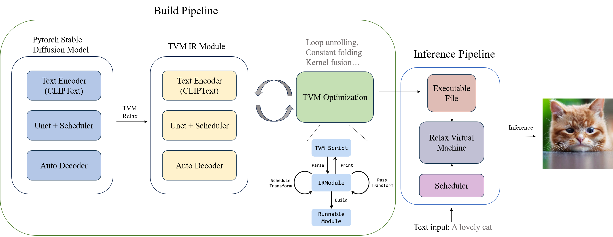
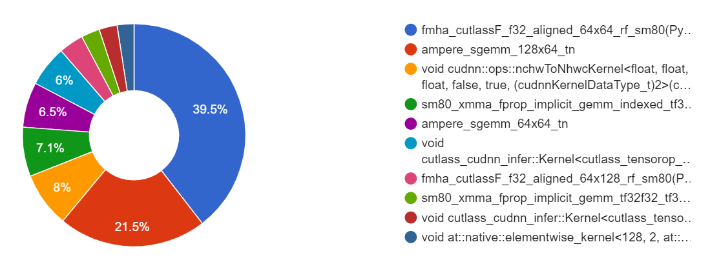
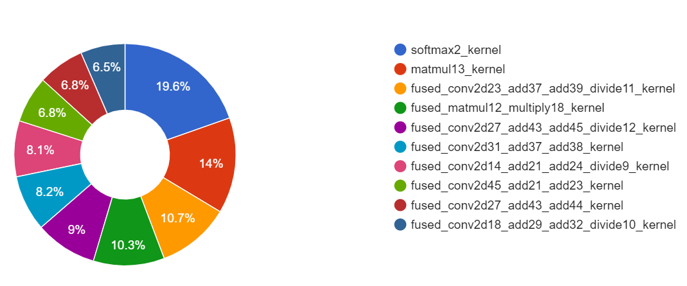
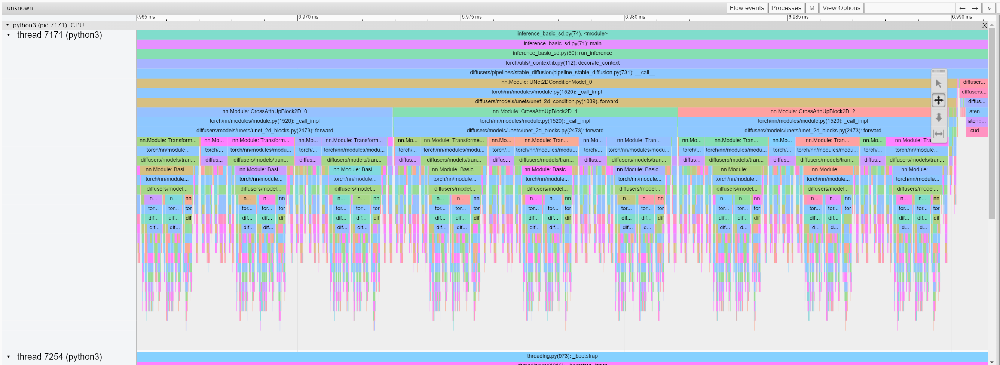
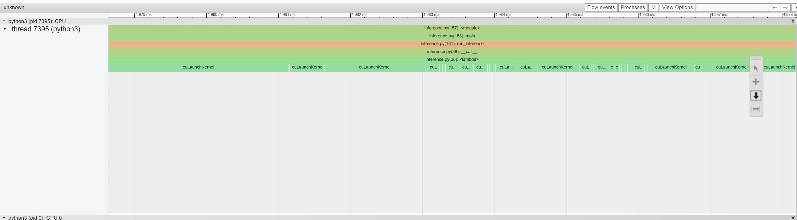
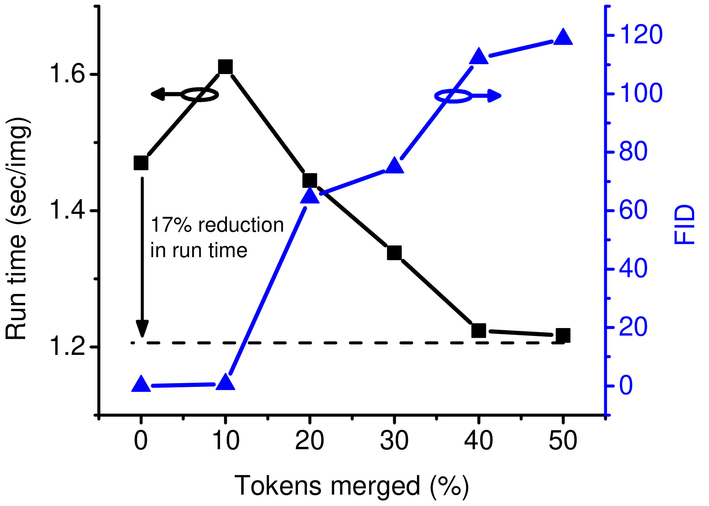
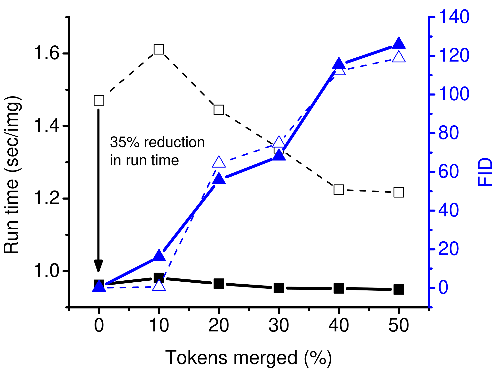

# TVMerge-stable-diffusion: Optimized Stable Diffusion Inference with TVM Compiler and Token Merging

## Overview
This project optimizes the Stable Diffusion AI model using the [TVM compiler](https://tvm.apache.org/) and the token merging technique from the [paper by Bolya et al. (2023)](https://openaccess.thecvf.com/content/CVPR2023W/ECV/papers/Bolya_Token_Merging_for_Fast_Stable_Diffusion_CVPRW_2023_paper.pdf). These improvements significantly enhance image generation speeds by optimizing the model for various hardware platforms and merging redundant tokens in generated images.

## Features

- **TVM Compiler Integration**: Leverages TVM, an open-source machine learning compiler framework for CPUs, GPUs, and other hardware, to optimize and compile the Stable Diffusion model for maximum performance.

    - **TVM Optimization Process**:
        1. **Model Capturing with TVM.relax**: Utilizes TVM.relax to transform key components of the Stable Diffusion PyTorch model into an IRModule within TVM, facilitating further optimization steps.
        2. **Automated Optimization with MetaSchedule**: Employs MetaSchedule to automatically generate optimized programs. These optimizations are fine-tuned for specific devices using native GPU runtimes to create efficient GPU shaders.

- **Token Merging Optimization**: Integrated the token merging technique to speed up diffusion models by exploiting natural redundancy in the generated images, which reduces the number of computations needed for image synthesis.

- **Meta Scheduling**: Utilizes TVM's advanced meta scheduling features to automatically generate efficient schedules for machine learning operations, adapting to the specific characteristics of the target hardware.

## Optimization Pipeline


*Figure: TVM Optimization and Inference Pipeline for Stable Diffusion - This illustration details the sequence of operations and optimizations applied to the Stable Diffusion model using Apache TVM, showcasing the integration of encoding, scheduling, decoding, and execution stages.*

##  Project Structure
- **models/**: Contains the model definitions and transformations necessary for the Stable Diffusion models. These scripts handle the conversion of models into TVM compatible format.

- **schedulers/**: This directory includes the scheduling logic for different parts of the model inference process. Schedulers manage how and when different components of the model are executed during inference.

- **scheduler_db/**: Stores the database files used by TVM's auto-scheduling features to optimize model execution. This database captures performance metrics and tuning parameters to improve execution efficiency.

- **utils/**: Utility functions.

- **build.py**: Script that compiles the models, applying optimizations and preparing them for deployment. This script handles the entire flow from loading models, applying transformations, and saving the compiled artifacts.

- **inference.py**: The main inference script that uses the compiled TVM modules to perform model predictions based on input data. It orchestrates the loading of models, application of schedulers, and execution of the model pipeline.

- **inference_basic_sd.py**: Inference script for a basic, unoptimized implementation of the Diffusers Stable Diffusion pipeline. This script is used primarily for comparison with the optimized versions, allowing users to evaluate the performance enhancements provided by the TVM and custom scheduler integration.

- **requirements.txt**: Lists all Python dependencies required by the project. This file is used to set up the Python environment for development and execution.


## Installation

1. **Install TVM**: Follow the instructions from [TVM’s documentation](https://tvm.apache.org/docs/install/from_source.html) to build TVM from source.
   
2. **Install Python Dependencies**: Run the following command to install required Python libraries:
   ```bash
   pip install -r requirements.txt
   ```

## Usage

To use the optimized model, follow these steps:

### Build the Model
Run the `build.py` script to prepare and compile the model:

```bash
python build.py
```
Optional Arguments:
- `--target` (default: "cuda"): Specify 'cuda' for GPUs or 'llvm' for CPUs.
- `--database-dir` (default: "scheduler_db/"): Path to the schedule database.
- `--output-dir` (default: "artifacts"): Path where compiled artifacts will be saved.
- `--enable-cache` (default: 1): Use cached models if available.
- `--enable-debug`: Enable debug mode to dump detailed debug outputs.
- `--apply-tome`: Apply token merging to enhance inference speed.

### Run Inference
Generate images using the `inference.py` script with a text prompt:

```bash
python inference.py --prompt "A photo of an astronaut riding a horse on Mars."
```
Optional Arguments:
- `--device` (default: "auto"): Specify 'cuda' for GPU or 'auto' for automatic device detection.
- `--enable-debug`: Enable debug mode to record detailed computational steps.
- `--artifacts-dir` (default: "artifacts"): Directory containing the built output and logging.
- `--output-dir` (default: "outputs"): Directory where output images will be saved.
- `--prompt` (default: "A photo of an astronaut riding a horse on mars."): Text prompt for the image generation.
- `--negative-prompt` (default: ""): Negative prompt text.
- `--scheduler-label` (default: the label of a specific scheduler): Specifies the scheduler to use.
- `--enable-profiling`: Enable performance profiling, useful for analyzing model performance.


## Performance Analysis

This section presents a comprehensive comparison of performance metrics between the original Stable Diffusion model and its optimized counterpart using TVM and Token Merging.

### Performance Comparison Table

The following table provides detailed metrics comparing the original Stable Diffusion implementation with the TVM optimized version:

| Metric                       | Original Stable Diffusion | TVM Optimized Stable Diffusion |
|------------------------------|---------------------------|--------------------------------|
| GPU Utilization (%)          | 91.23                     | 58.42                          |
| Est. SM Efficiency (%)       | 90.14                     | 40.06                          |
| Est. Achieved Occupancy (%)  | 31.49                     | 7.02                           |
| Inference Time (s)           | 9.11                      | 5.68                           |
| **Category**                 | **Original**              | **TVM Optimized**              |
| Average Step Time            | 9,102,276 (100%)          | 12,578 (100%)                  |
| Kernel                       | 8,304,252 (91.23%)        | 7,348 (58.42%)                 |
| CPU Exec                     | 721,519 (7.93%)           | 577 (4.59%)                    |
| Other                        | 69,621 (0.76%)            | 4,653 (36.99%)                 |

### Kernel Utilization

Comparison of the top 10 kernel usages before and after TVM optimization is illustrated below:


*Baseline Kernel Usage*


*TVM Optimized Kernel Usage*

### Trace Timelines

Trace timelines provide a visual representation of performance differences in the computation timeline before and after optimizations:


*Baseline Trace Timeline*


*TVM Trace Timeline*

### Token Merging Performance Impact

The graph below shows the inference runtime per image across different token merging ratios from 0% to 50% and the corresponding Fréchet Inception Distance (FID) score. Lower FID scores indicate higher quality images.


*Token Merging Performance and Image Quality*

### XFormers Integration Analysis

XFormers is a library designed to optimize transformer models by providing highly efficient building blocks. The integration of XFormers with our Stable Diffusion pipeline offers potential improvements in terms of inference speed and model quality, measured by the Fréchet Inception Distance (FID) score.

Below is a comparative analysis showing the impact of utilizing the XFormers library on the performance of our Stable Diffusion model. We compare run times and FID scores obtained with XFormers (solid symbols) against those obtained without using XFormers (hollow symbols).


*Figure: The run time and FID score of Stable Diffusion inference with the XFormers library compared to results obtained without it.*

### Generated Images Comparison

Generated images from the text prompt: "a yellow puppy playing with a ball" at different token-merging ratios:


*Generated Images with Varying Token Merging Ratios*
